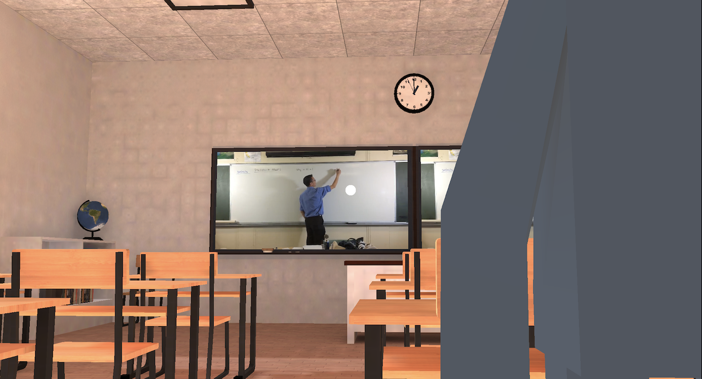
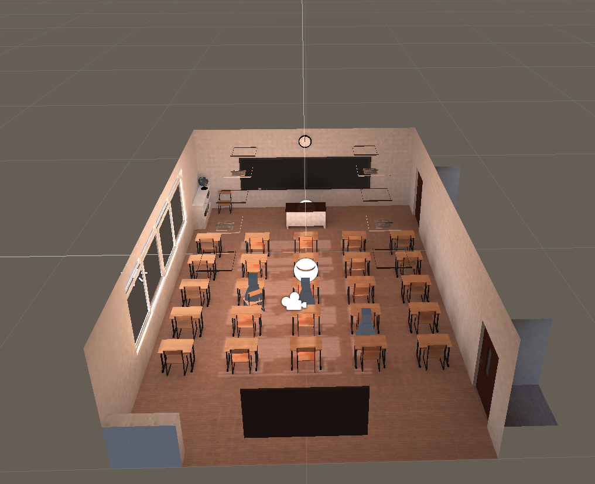

# The Virtual Classroom (HackMIT 2020 2nd Place)
A VR Classroom as a better alternative to existing online platforms for current online learning solutions (e.g. Zoom, Google Meet, etc.). With real-time updated fellow students on their own devices and a live teacher at the front of the class, the virtual classroom provides you with the experience of a real classroom from the safety of your own home.

# How It Was Made
* Unity - VR App
* Agora - RT Video Call
* Firebase - Student Movement Tracking
* HTML - Teacher App
* XCode - iOS App Compiler

# Spectacle - Project Link
https://spectacle.hackmit.org/project/538

# Images

